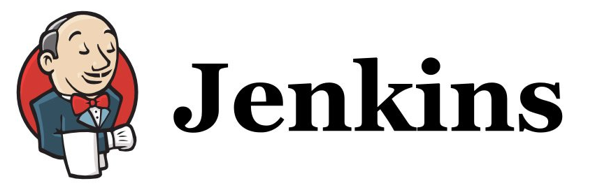
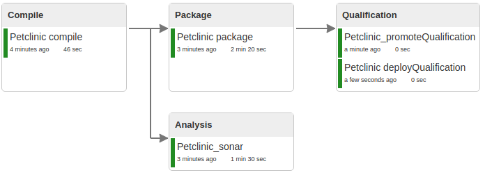
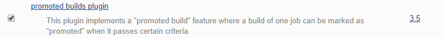
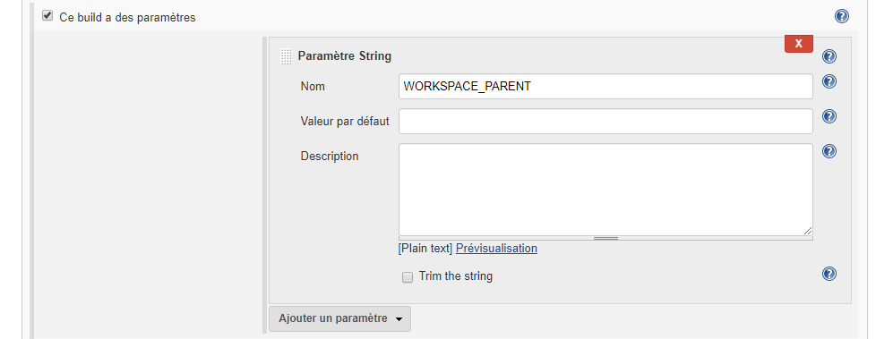
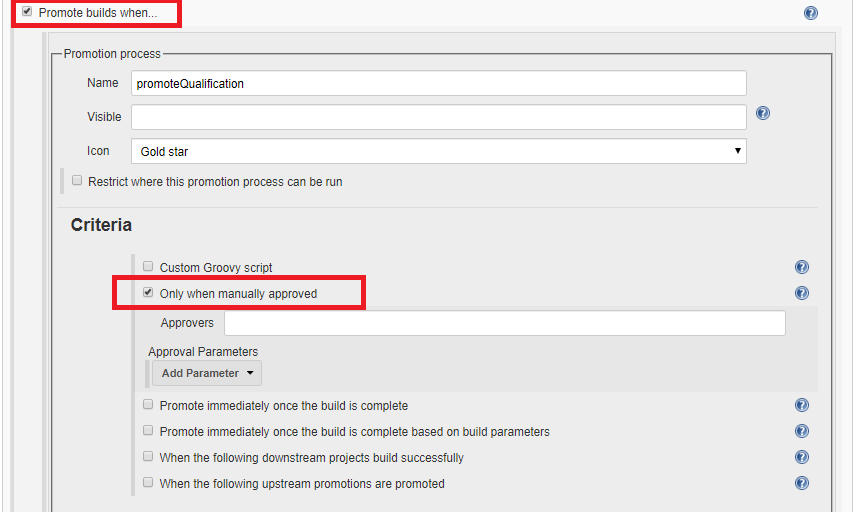
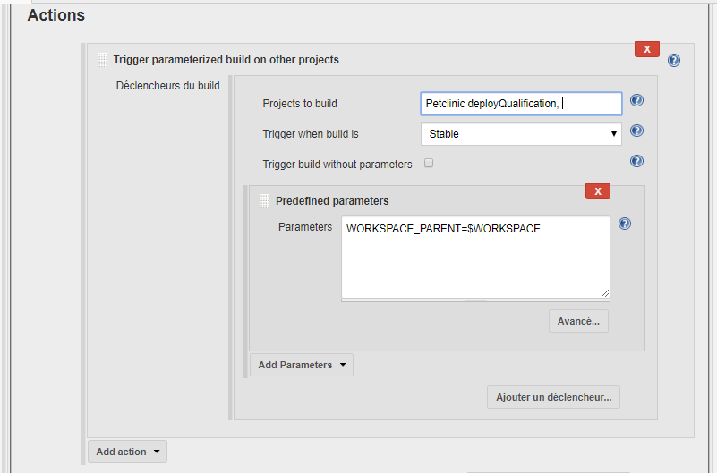
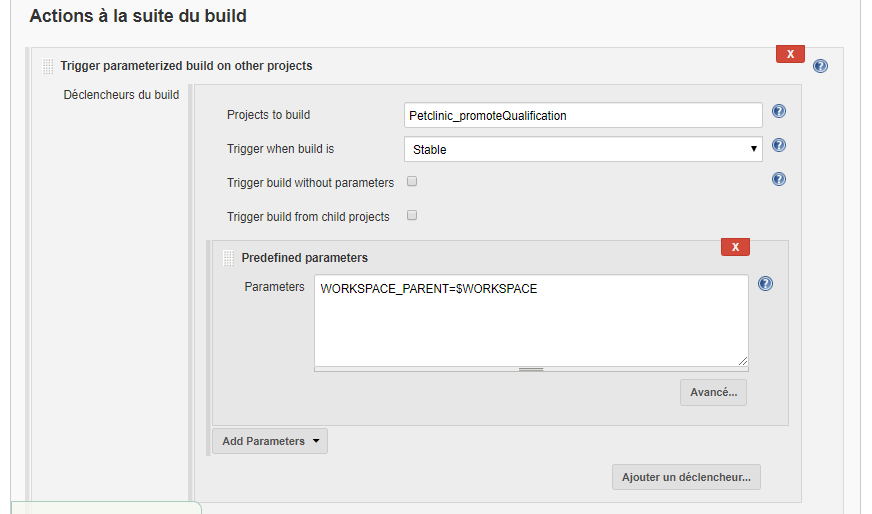
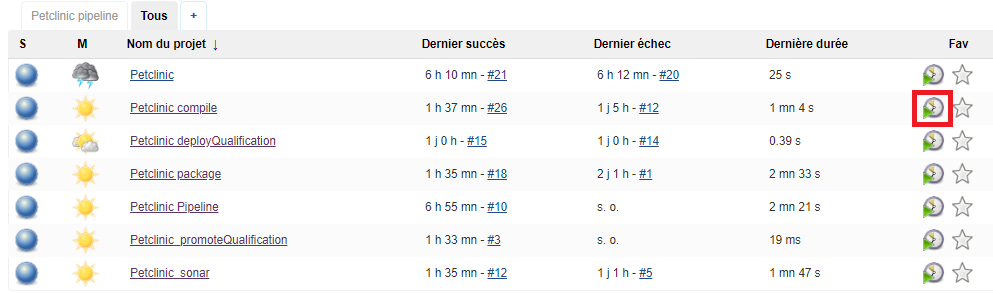

# Utilisation du plugin "promoted builds"
But : utiliser le plugin "**promoted builds**" pour valider manuellement le déploiement sur le serveur de qualification

- Cible à atteindre :

- Installer le plugin "**promoted builds**"
  

## Création de l'item Petclinic_promoteQualification
- Description : cet item doit permettre de stopper la chaine du build après la génération du package et obliger l'utilisateur à approuver manuellement le démarrage de la dernière étape du build.
- Nom : Petclinic_promoteQualification
- Type : Projet free-style
- Paramètre string : WORKSPACE\_PARENT
- Actions :
1. Prends en paramètre le workspace du build parent (WORKSPACE\_PARENT)  

2. Activer l'option "**Promote builds when...**", spécifier un critère et une action

3. Modifier l'item "**Petclinic_package**" qui doit maintenant appeler ce nouvel item.

4. Lancer un build de l'item "**Petclinic\_compile**" manuellement

