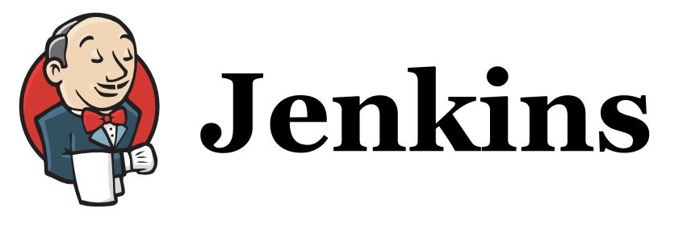

----------

[Solution TP1 : Installation et création d'un projet free-style](JENKINS_solution.md "Ouvrir le TP1 Jenkins")   
[Solution TP2 : Création d'un projet Maven](JENKINS1_solution.md "Ouvrir le TP2 Jenkins")    

----------

[Solution TP1 : Installation et analyse du projet spring-framework-petclinic](SONAR_solution.md "Ouvrir le TP1 Sonarqube")   
[Solution TP2 : Quality Profiles - Quality Gates](SONAR1_solution.md "Ouvrir le TP2 Sonarqube")   
[Solution TP3 : Intégration dans Jenkins](SONAR2_solution.md "Ouvrir le TP3 Sonarqube") 

----------

# Optionel

[Solution TP1 : Jenkins - Utilisation du plugin "promoted builds"](OPTION1_solution.md "Ouvrir le TP1 Optionel")  
[Solution TP2 : Jenkins - Utilisation d'un Jenkinsfile](OPTION2_solution.md "Ouvrir le TP2 Optionel")  

 
